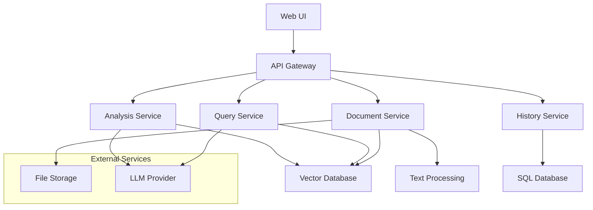

# Design Document

## Overview

The LLM RAG Contract Analyzer is a web-based application that combines document processing, vector search, and large language models to provide intelligent contract analysis. The system follows a microservices architecture with clear separation between document processing, vector storage, LLM integration, and user interface components.

## Architecture



## Components and Interfaces

### Document Service
**Responsibility:** Handle document upload, validation, processing, and vectorization

**Key Methods:**
- `uploadDocument(file, userId)` - Validates and stores uploaded documents
- `processDocument(documentId)` - Extracts text and creates vector embeddings
- `validateFile(file)` - Ensures file meets format and size requirements

**Dependencies:**
- File storage system (AWS S3 or local filesystem)
- Text extraction libraries (PyPDF2, python-docx)
- Vector database (Pinecone, Weaviate, or Chroma)
- Embedding model (OpenAI text-embedding-ada-002 or similar)

### Query Service
**Responsibility:** Process natural language questions and generate responses using RAG

**Key Methods:**
- `processQuery(question, documentId, userId)` - Main query processing pipeline
- `retrieveRelevantSections(query, documentId)` - Vector similarity search
- `generateResponse(context, question)` - LLM-powered response generation

**Dependencies:**
- Vector database for similarity search
- LLM provider (OpenAI GPT-4, Anthropic Claude, or Azure OpenAI)
- Embedding model for query vectorization

### Analysis Service
**Responsibility:** Automatically identify and extract key contract clauses

**Key Methods:**
- `analyzeContract(documentId)` - Orchestrates full contract analysis
- `identifyClauseTypes(text)` - Uses LLM to classify contract sections
- `extractKeyTerms(clauses)` - Extracts important terms from identified clauses
- `flagMissingClauses(identifiedClauses)` - Identifies potential gaps

**Dependencies:**
- LLM provider for clause classification
- Predefined clause templates and patterns
- Vector database for semantic search

### History Service
**Responsibility:** Manage user sessions and analysis history

**Key Methods:**
- `saveSession(userId, documentId, queries, responses)` - Persist analysis session
- `getUserHistory(userId)` - Retrieve user's previous analyses
- `deleteSession(sessionId, userId)` - Remove historical data

**Dependencies:**
- SQL database (PostgreSQL or SQLite)
- Session management utilities

## Data Models

### Document
```typescript
interface Document {
  id: string;
  userId: string;
  filename: string;
  fileType: 'pdf' | 'docx' | 'txt';
  fileSize: number;
  uploadedAt: Date;
  processedAt?: Date;
  status: 'uploaded' | 'processing' | 'ready' | 'error';
  textContent?: string;
  vectorIds: string[];
}
```

### Query Session
```typescript
interface QuerySession {
  id: string;
  userId: string;
  documentId: string;
  createdAt: Date;
  queries: QueryResponse[];
}

interface QueryResponse {
  question: string;
  answer: string;
  sources: DocumentSection[];
  timestamp: Date;
}
```

### Contract Analysis
```typescript
interface ContractAnalysis {
  id: string;
  documentId: string;
  analyzedAt: Date;
  identifiedClauses: ContractClause[];
  missingClauses: string[];
  riskFlags: RiskFlag[];
}

interface ContractClause {
  type: 'termination' | 'payment' | 'liability' | 'confidentiality' | 'other';
  content: string;
  location: DocumentLocation;
  summary: string;
  riskLevel: 'low' | 'medium' | 'high';
}
```

## Error Handling

### File Upload Errors
- **Invalid Format:** Return 400 with supported formats list
- **File Too Large:** Return 413 with size limit information
- **Processing Failed:** Return 500 with retry instructions

### Query Processing Errors
- **Document Not Ready:** Return 202 with processing status
- **LLM Service Unavailable:** Return 503 with fallback message
- **No Relevant Content:** Return 200 with "no information found" response

### Vector Database Errors
- **Connection Failed:** Implement retry logic with exponential backoff
- **Index Not Found:** Trigger document reprocessing
- **Search Timeout:** Return partial results with timeout notice

## Testing Strategy

### Unit Testing
- Document validation logic
- Text extraction and chunking algorithms
- Vector similarity calculations
- LLM response parsing and formatting

### Integration Testing
- End-to-end document processing pipeline
- RAG query flow from question to response
- Database operations and data persistence
- External service integrations (LLM, vector DB)

### Performance Testing
- Document processing time for various file sizes
- Query response time under concurrent load
- Vector search performance with large document sets
- Memory usage during document processing

### Security Testing
- File upload validation and sanitization
- User authentication and authorization
- Data encryption at rest and in transit
- Input validation for all user-provided data